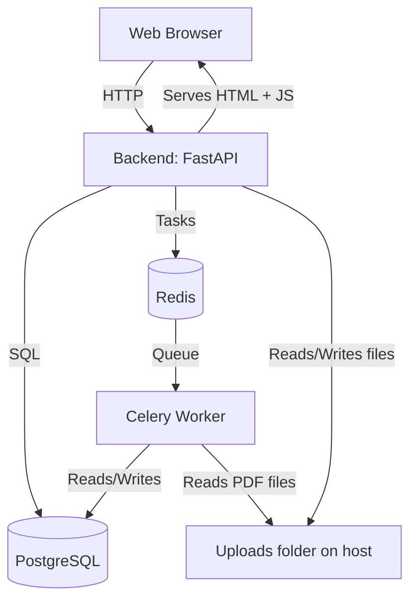

## Технические решения

### 1. FastAPI
- **Асинхронность** – высокая производительность, неблокирующие операции.
- **Простота** - легко пишется

### 2. PostgreSQL
- **Встроенный tsvector** – не требует отдельного поискового движка.
- **GIN-индексы** – обеспечивают быстрый поиск даже при большом объёме текста.

### 3. Асинхронная обработка (Celery + Redis)
- **Вынос тяжёлых операций** – PDF могут быть большими, их обработка не блокирует API.
- **Redis как брокер** – лёгкий и надёжный, встроен в экосистему Python.
- **Масштабируемость** – можно запустить несколько воркеров для параллельной обработки.

### 4. Аутентификация (JWT)
- **Бессерверная** – не требует хранения сессий на сервере.
- **Токен в заголовке/параметре** – удобно для API и для экспорта в новой вкладке.
- **bcrypt** – надёжное хеширование паролей.

### 5. Разбивка на чанки
- **Целевой размер чанка ~1000 символов** – оптимально для точного поиска и ранжирования.

### 6. Анализ документов
- **Ключевые слова (YAKE)** – не требует обучения, работает на статистике текста, выдаёт релевантность.
- **Частотный анализ** – простой подсчёт слов с удалением стоп-слов.

### 11. Docker
- **Изоляция сервисов** – каждый компонент в своём контейнере.
- **Volumes для данных и логов** – сохранность между перезапусками.
- **docker-compose** – простой запуск всего стека одной командой.

### 12. Доступ из интернета
- **localtunnel** – легко использовать для временного показа.

